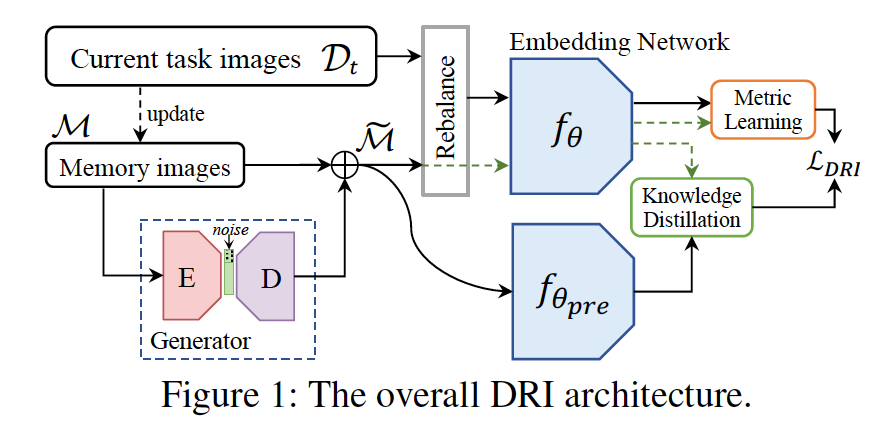
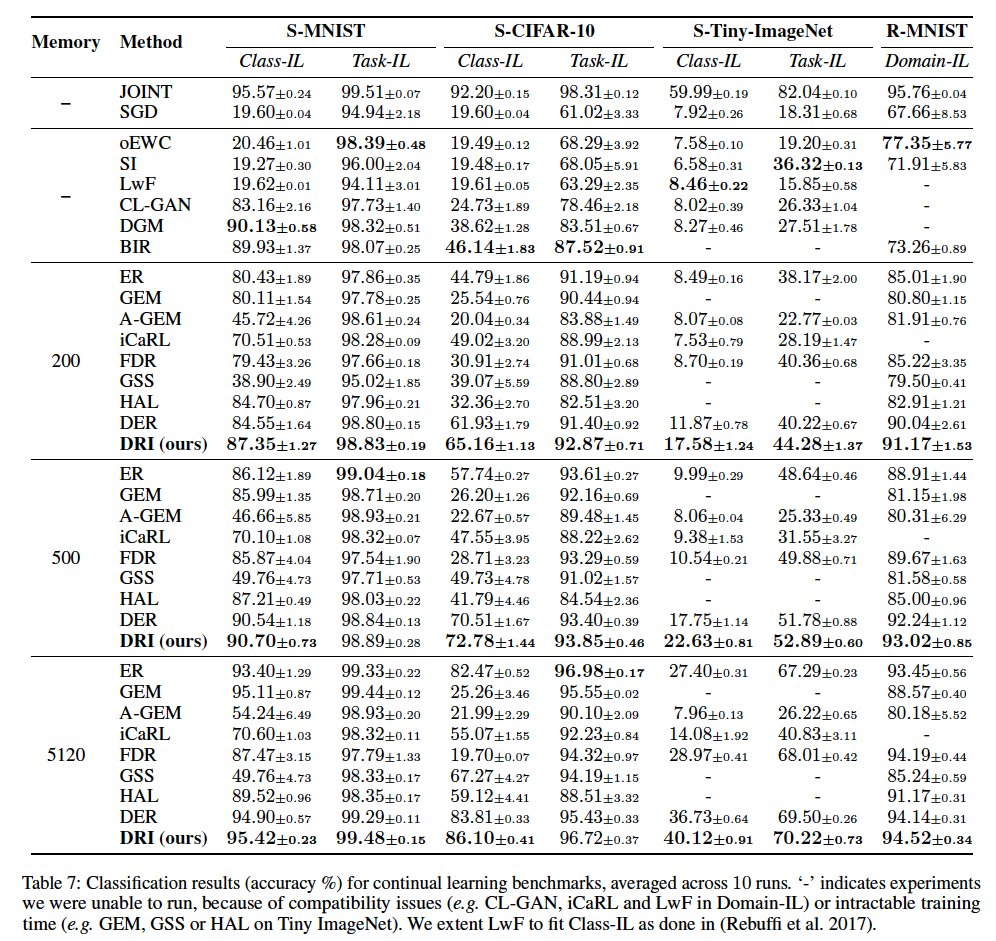
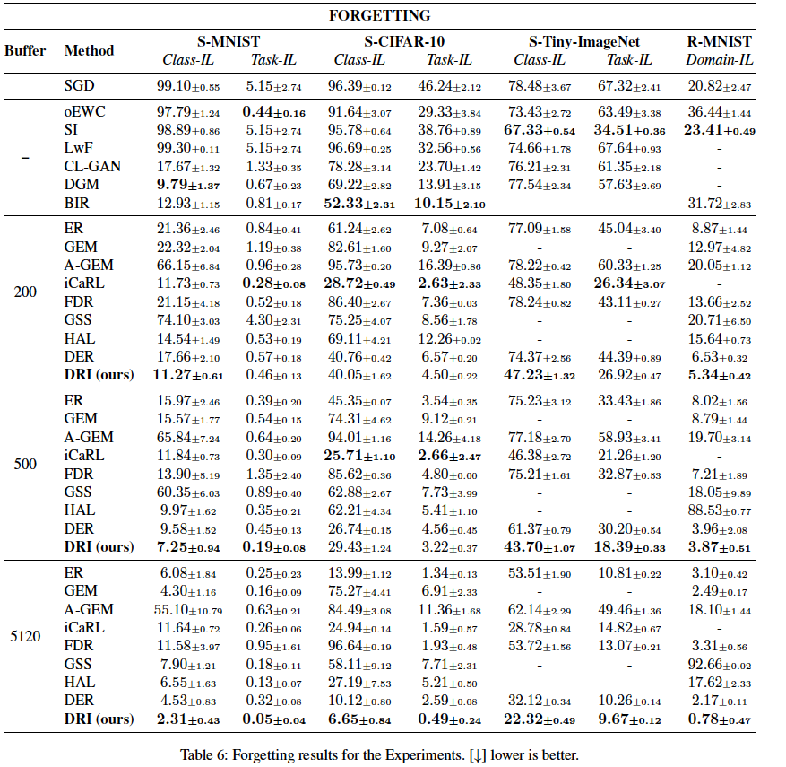
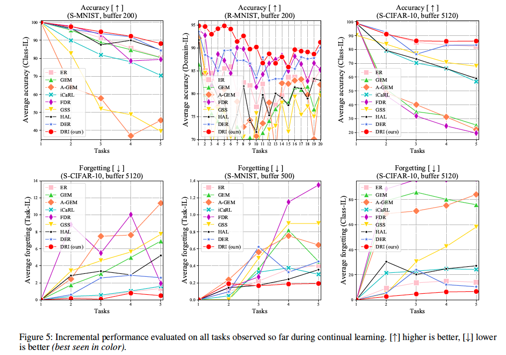

# Deep Retrieval and Imagination (DRI)

## 📋Dependence

torch==1.3.1 

torchvision==0.4.2 

numpy==1.16.4 

absl-py==0.9.0 

cachetools==4.0.0 

certifi==2019.11.28

chardet==3.0.4 

Cython==0.29.15

google-auth==1.11.2 

google-auth-oauthlib==0.4.1 

googledrivedownloader==0.4 

grpcio==1.27.2 

idna==2.8 

Markdown==3.2.1 

oauthlib==3.1.0 

Pillow==6.1.0 

protobuf==3.11.3 

pyasn1==0.4.8 

pyasn1-modules==0.2.8 

quadprog==0.1.7 

requests==2.22.0 

requests-oauthlib==1.3.0 

rsa==4.0 

six==1.14.0 

tensorboard==2.0.1 

urllib3==1.25.8 

Werkzeug==1.0.0 

## 📋Running

- Use ./utils/main.py to run experiments. 

- New models can be added to the models/ folder.

- New datasets can be added to the datasets/ folder.

## 📋Results

We compare DRI against six rehearsal-based methods (ER, GEM, A-GEM, GSS, FDR, HAL), one pseudo-rehearsal-based method (CL-GAN), three methods leveraging Knowledge Distillation (LwF, iCaRL, DER) and two parameter-based methods (oEWC, SI). We further provide an upper bound (JOINT) obtained by training all tasks jointly and a lower bound simply performing SGD without any countermeasure to forgetting.

- 
  First, we compare the performance in terms of overall accuracy at the end of all tasks, shown in Table 7. Results are averaged across ten runs, each one involving a different initialization. DRI achieves state-of-the-art performance in almost all setting. Especially in the case of small memory, the advantage of DRI is more obvious, e.g., DRI can reduce the classification error by more than 5% on Tiny ImageNet with 200 memory capacity. This is supported by IGAN providing additional imaginary data to alleviate the memory-limitation problem. The gap is unbridgeable when comparing with oEWC and SI, which indicates that the regularization towards old parameters is not effective in preventing forgetting. CL-GAN's performance on complex datasets, i.e., CIFAR and Tiny ImageNet, degrades significantly due to its difficulty in generating complex and clear images. Appendix C provides more detailed results.
- Second, to compare the preventing forgetting capability, we assess the *average forgetting* that measures the performance degradation in subsequent tasks. Table 6 shows forgetting results across ten runs in different learning scenarios.
  Our approach suffers from less forgetting than all the other methods, as DRI constructs a unified embedding space throughout the learning and consolidates knowledge through deep retrieval.
- Finally, we demonstrate the *average incremental performance* which is the result of evaluating on all the tasks observed so far after completing each task. 
  As shown in Figure 5, the results are curves of accuracy and forgetting after each task. The performance of most methods degrades rapidly as new tasks arrive, while DRI consistently outperforms the state-of-the-art methods throughout the learning.

The source code will be made publicly available.

All rights reserved.

